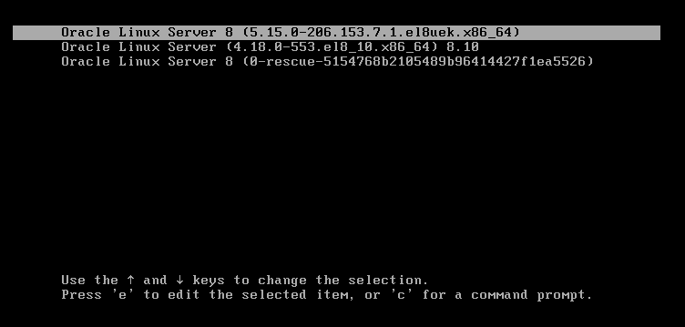
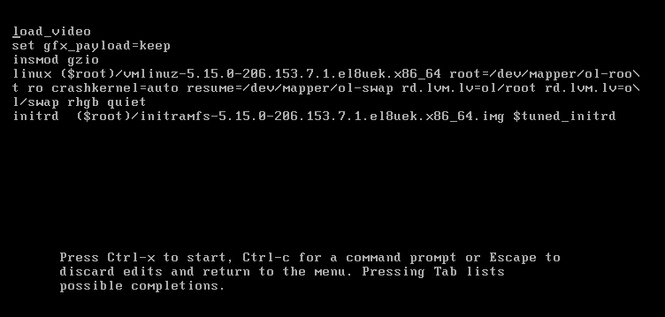
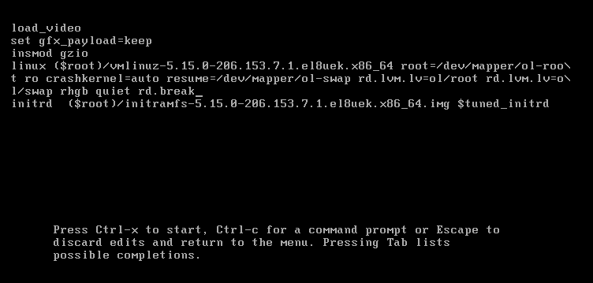
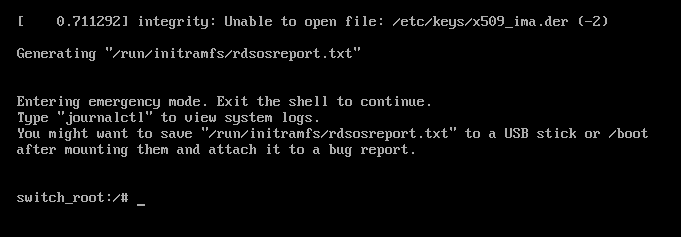

# LAB 01 - Emergency Boot Menu Editing

## Prerequisites
- A Linux system (physical or virtual)
- GRUB 2 bootloader
- Basic familiarity with Linux command line

## Step 1: Access the GRUB Menu
1. Restart your system or boot up your virtual machine
2. Watch carefully during boot and when you see the GRUB menu appear:
    - Press `Shift` key repeatedly (for BIOS systems)
    - Press `Esc` key repeatedly (for UEFI systems)
    - This interrupts the automatic boot process
3. You should see the GRUB menu with options like:
4. There is a timer on this screen and it will automatically load the kernel, to stop the timer press the up/down arrow keys


the menu you're seeing at boot time is the GRUB (GRand Unified Bootloader) menu. It shows a list of installed kernels and allows you to choose which one to boot.

###### 1. Oracle Linux Server 8 (5.15.0-206.153.7.1.el8uek.x86_64) — Default
- Kernel version: 5.15.0-206.153.7.1.el8uek
- Type: This is a UEK (Unbreakable Enterprise Kernel).
- Architecture: x86_64 (64-bit)
- Default: This is the default option, which means the system will boot into this kernel unless you select another one.
> UEK (Unbreakable Enterprise Kernel)
> is Oracle's custom-built kernel for Oracle Linux, designed for better performance, scalability, and reliability, especially for Oracle software (like Oracle Database). It includes newer features than the standard RHEL-compatible kernel.

###### 2. Oracle Linux Server (4.18.0-553.el8_10.x86_64) 8.10
- Kernel version: 4.18.0-553.el8_10
- Type: This is the RHEL-compatible kernel (also known as the Red Hat Compatible Kernel, or RHCK).
- Architecture: x86_64 (64-bit)
- Version: 8.10 refers to Oracle Linux 8.10.

> This kernel is intended to be 100% compatible with Red Hat Enterprise Linux (RHEL). It's generally more conservative in features but very stable.

###### 3. Oracle Linux Server 8 (0-rescue-5154768b2105489b96414427f1ea5526)
- Kernel version: Rescue kernel
- Purpose: This is a rescue mode boot option. It boots a minimal environment in case of system failure or misconfiguration.
- UUID-like string: This is a unique identifier for the rescue image.
> Use this option if your system can't boot properly into the regular kernels, to recover data or fix configuration issues.

| Entry                   | Kernel | Type     | Purpose                                                 |
| ----------------------- | ------ | -------- | ------------------------------------------------------- |
| **5.15.0-206...el8uek** | 5.15   | **UEK**  | Default; optimized for performance and Oracle workloads |
| **4.18.0-553...el8_10** | 4.18   | **RHCK** | RHEL-compatible kernel; more conservative and stable    |
| **0-rescue-...**        | Rescue | Minimal  | Recovery tool in case of boot failure                   |


## Step 2: Enter GRUB Edit Mode
1. Use arrow keys to select your default Linux entry
2. Press **`e`** to edit the boot parameters
3. You'll now see the GRUB configuration for that boot entry


## Step 3: Modify Kernel Parameters
Find the line starting with `linux` and:
1. Navigate to the end of this line using arrow keys
2. Add **`rd.break`** at the end of the line and press **ctrl+x** to boot the system.



> the **`rd.break`** parameter is used during boot to interrupt the boot process at a specific point, allowing you to gain root access without needing the root password. This method involves using emergency mode, which gives you a root shell where you can reset the password.

When you add **`rd.break`** at the end of the boot parameters in GRUB edit mode, you are telling the system to break the boot process early and drop into an emergency shell. Specifically, **`rd.break`** halts the boot process just after the root file system has been mounted but before it has been fully initialized. This allows you to make necessary changes to the system, such as resetting the root password, before the system fully boots up.

Once you break into this emergency shell, you can mount the root file system as read-write, reset the root password, and then resume the boot process.


## Step 4: Boot with Modified Parameters
1. After making changes, press **`Ctrl + X`** or **`F10`** to boot with the modified parameters
2. The system should boot into a root shell prompt


- Once the system is booted, Linux will mount the root filesystem under **`/sysroot`** with read-only permissions.

- To make changes, you need to **remount** it with **read-write** permissions using the following command:
```bash
mount -o remount,rw /sysroot
```
- Next, change the root to the sysroot directory:
  - The chroot command (stands for change root) can be used to change the system's root directory to a temporary filesystem, in this case, /sysroot
```bash
chroot /sysroot
``` 
This command changes the root directory for the current running process to `/sysroot`, effectively giving you access to the actual root filesystem of your installed Linux system.


## Step 5: Reset the Root Password
1. At the root shell prompt, type the following command to reset the root password:
```bash
passwd
```
2. Follow the prompts to enter and confirm the new root password

## Step 6: Relabel SELinux Contexts
1. If SELinux is enabled on your system, you need to relabel the filesystem to ensure proper security contexts
2. Create a file named `.autorelabel` in the root directory:
```bash
touch /.autorelabel
```
The last step is to allow SELinux to rewrite the security context for all the files on the next reboot. To do this, we must create an empty hidden file named .autorelabel under the root filesystem.
3. Exit the chroot environment:
4. Type `exit` to leave the chroot
5. Type `exit` again to exit the emergency shell and continue the boot process
6. The system will reboot and perform a filesystem relabeling if SELinux is enabled
7. The system will then boot normally
8. Log in using the new root password you set earlier
9. You should now have full root access to the system
10. If SELinux relabeling is required, it may take some time during the next boot
11. After relabeling, the system will boot normally
12. Log in with the new root password
13. You should now have full root access to the system

